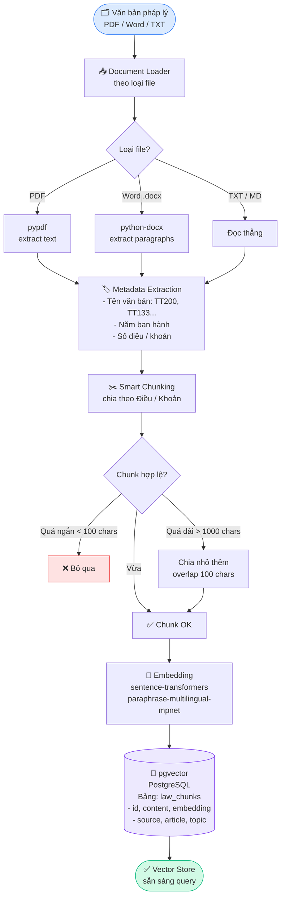
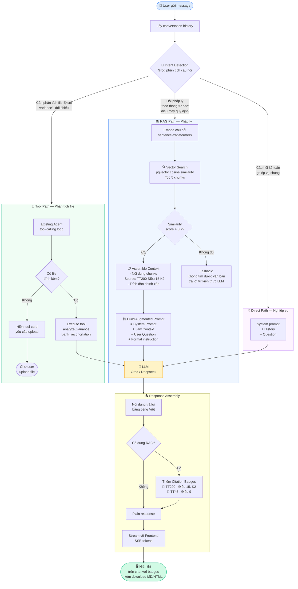
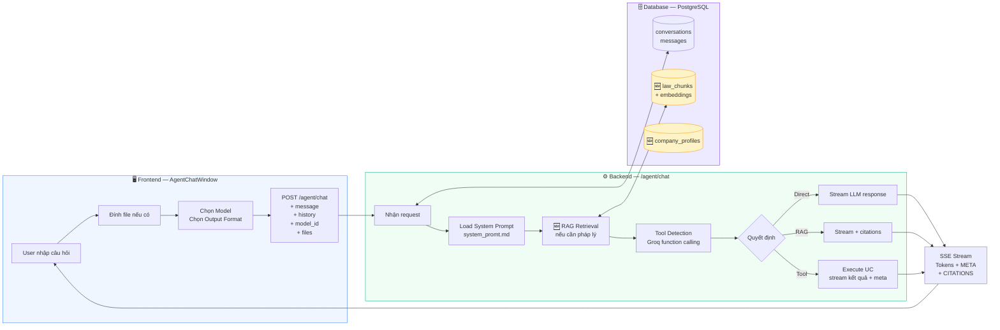
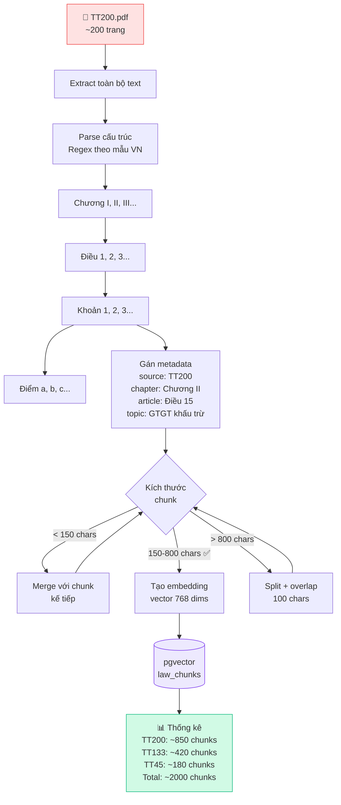
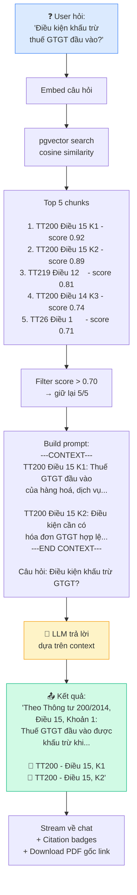
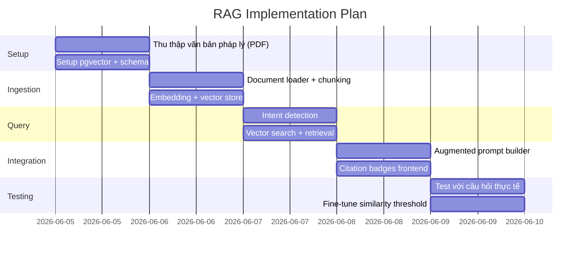

# RAG System — VSF AI Agent Kế Toán
## Flowchart thiết kế trước khi implement

---

## PIPELINE 1 — Ingestion (chạy 1 lần, khi setup)



---

## PIPELINE 2 — Query (chạy mỗi khi user hỏi)



---

## PIPELINE 3 — Tích hợp vào Agent hiện có



---

## PIPELINE 4 — Chunking Strategy chi tiết



---

## PIPELINE 5 — Response với Citations



---

## Kế hoạch implement theo ngày



---

## Files sẽ tạo mới

```
backend/
├── services/
│   ├── rag/
│   │   ├── __init__.py
│   │   ├── ingestor.py        ← load PDF → chunks → embeddings
│   │   ├── retriever.py       ← query pgvector → top-k chunks
│   │   └── intent.py          ← detect: RAG / Tool / Direct
│   └── file_analyzer.py       ← (đã có ✅)
├── routers/
│   ├── agent.py               ← (update: thêm RAG call)
│   └── rag_admin.py           ← POST /rag/ingest, GET /rag/stats
├── models/
│   └── law_chunk.py           ← SQLAlchemy model cho pgvector
├── data/
│   └── laws/                  ← PDF văn bản pháp lý
│       ├── TT200_2014.pdf
│       ├── TT133_2016.pdf
│       └── TT45_2013.pdf
└── scripts/
    └── ingest_laws.py         ← chạy 1 lần để nhập dữ liệu

frontend/
└── components/
    └── CitationBadge.tsx      ← component hiển thị nguồn trích dẫn
```
